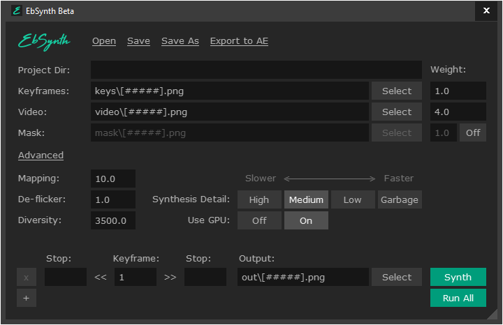
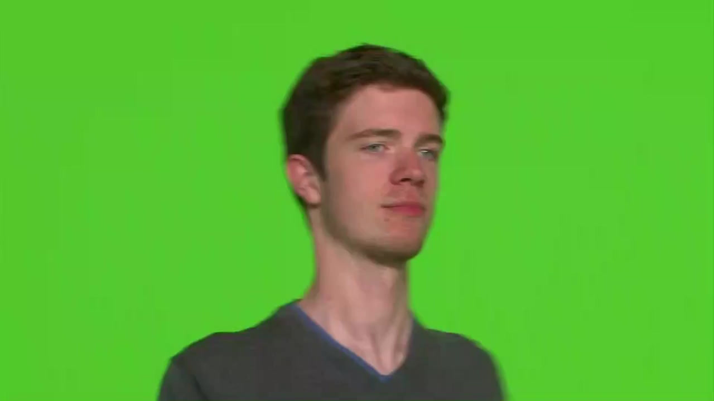
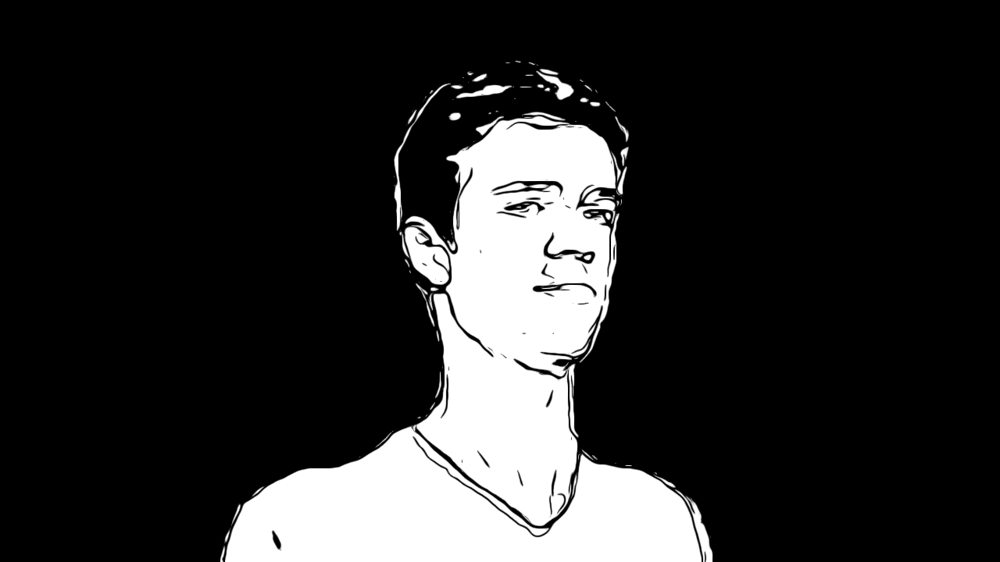
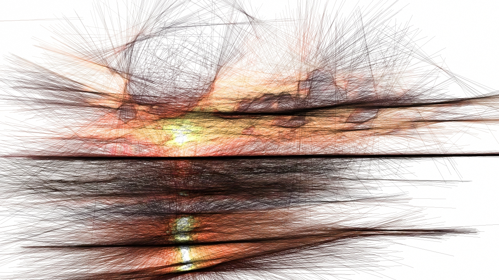
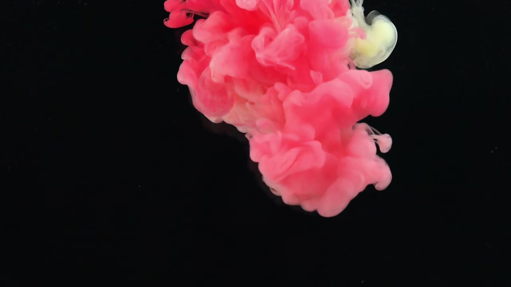
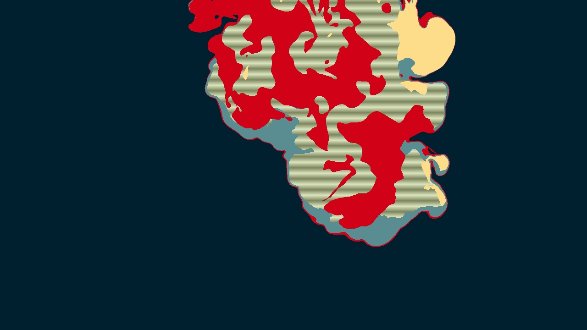
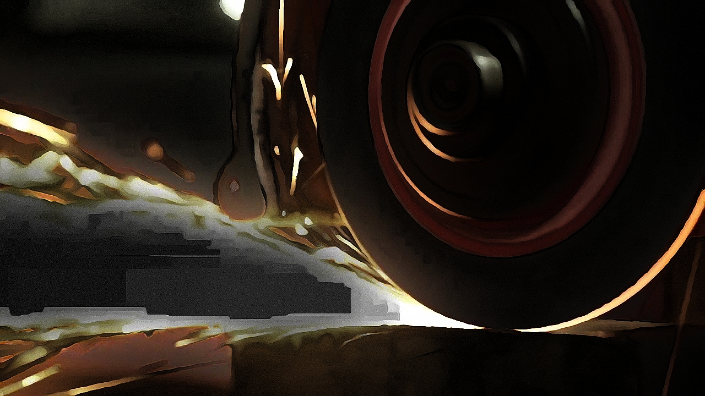

## ebsynth(gui)
ebsynth is a gui program that takes 1 or few images as style and applies them to an image sequence, unlike other style transfer programs ebsynth tries to stay as close to the source materaial as possible, you can find the beta version of the software from their website [here](https://ebsynth.com/) unfortunently there is no linux version available at the moment and the release version is meant to be a paid product but we still have access to the beta version for free on windows and mac os

<br>

### quick links
 * [The basics](https://github.com/junguler/_image-manipulation/tree/main/Ebsynth(gui)#the-basics)
 * [1st step, download a video](https://github.com/junguler/_image-manipulation/tree/main/Ebsynth(gui)#first-step-find-a-good-clip)
 * [2nd step, make a clip and image sequence](https://github.com/junguler/_image-manipulation/tree/main/Ebsynth(gui)#second-step-turn-the-clip-to-an-image-sequence)
 * [3rd step, choose a keystroke and apply filter](https://github.com/junguler/_image-manipulation/tree/main/Ebsynth(gui)#third-step-choose-the-keystroke-and-apply-some-effects-to-it)
 * [4rd step, convert using ebsynth](https://github.com/junguler/_image-manipulation/tree/main/Ebsynth(gui)#forth-step-lets-convert)
 * [final step, make a video](https://github.com/junguler/_image-manipulation/tree/main/Ebsynth(gui)#fifth-step-convert-the-output-image-sequence-to-a-clip)
 * [More examples](https://github.com/junguler/_image-manipulation/tree/main/Ebsynth(gui)#more-examples)
 * [Comparing ebsyth to other style transfer programs](https://github.com/junguler/_image-manipulation/tree/main/Ebsynth(gui)#comparing-ebsynth-to-other-style-transfers)
 * [Glitch it](https://github.com/junguler/_image-manipulation/tree/main/Ebsynth(gui)#glitch-it)
 * [Combine ebsynth with other programs](https://github.com/junguler/_image-manipulation/tree/main/Ebsynth(gui)#combine-ebsynth-with-other-programs)
   * [with G'mic](https://github.com/junguler/_image-manipulation/tree/main/Ebsynth(gui)#with-gmic)
   * [with Primitive](https://github.com/junguler/_image-manipulation/tree/main/Ebsynth(gui)#with-primitive)
   * [with Geometrize](https://github.com/junguler/_image-manipulation/tree/main/Ebsynth(gui)#with-geometrize)
   * [with Triangle](https://github.com/junguler/_image-manipulation/tree/main/Ebsynth(gui)#with-triangle)

<br>

## source material
everything is taken from free, no copywright stock footage from youtube

<br>

## how the program looks


the easiest way to use the program is to provide a keyframe, an image sequence and hi `Run All`

<br>

## the basics
this program has a few limitations that you need to know about to make life easier for yourself, the first thing is the keystroke(s) has to be in the same dimensions (width and height) at the output image sequence and it also needs to be named with the same number of leading zeros, so if i have my keystroke that is named `img001.jpg` and my image sequence that starts at `img001.jpg` and ends at `img100.jpg` the programs can easily understand what is going on

this might seem like chore but i'll give some commandline on-liners to make your life easier especially when we are making an image sequence out of a video clip

there is also this amazing [github repo](https://github.com/MyNameJeremy/EzEb) that makes everything automated for you using python, check it out and give the author a star as a thank you

<br>

## first step, find a good clip
lets say i've found a good free video i want to apply some cool looking effects to, lets download it first with yt-dlp

```
yt-dlp -f 22 https://www.youtube.com/watch?v=L_zNbr8KfDo
```

lets rename this to something simplier to make life easier, i've named this `boy.mp4`

<br>

## second step, turn the clip to an image sequence
using ffmpeg, lets convert our newly downloaded clip to an image sequence, make a new folder and cd into it with the video inside

```
ffmpeg -y -i boy.mp4 -c:v mjpeg -q:v 2 -pix_fmt yuvj444p -sn -an -threads 0 %04d.jpg
```

notice we named our image seuqeunce starting 4 leading zeros using `%04d` so our first image starts at `0001.jpg` this is needed for ebsynth to easily function and see our image sequence

note if you have a large video that needs to be trimed down use the [losslesscut](https://github.com/mifi/lossless-cut/releases) program to easily make a small clip out of it or run this ffmpeg command if you prefer to stay at the command line and then turn the smaller clip to image sequence just like above example

```
ffmpeg -i boy.mp4 -ss 1 -to 4 -c copy boy2.mp4
```

the above command starts the smaller clip at 1 second and stops and 4 seconds, for the sake of making the example shorter i'm going to use a small section of this image sequence

<br>

## third step, choose the keystroke and apply some effects to it
now find a clear frame out of that image sequence that doesn't have any motion to it and is a good average of the whole clip, apply a filter/effect to it, it can be anything and my repo is full of examples of this, here i've used the lineart filter from G'mic

| raw | style |
| --- | --- |
|  |  |

<br>

## forth step, lets convert
now that you have your keystroke and image sequence put them on their own folders for easy usage, i'm using key and seq as folder names but you can name yours what you want, open your file manager window and drag the "key" folder to the keyframes section and your "seq" window to the video section and click on run all and wait for the program to finish doing it's thing

ebsynth is going to make a new folder with the `out_` prefix and the first name of your image sequence, so my output folder is called `out_0001`

<br>

## fifth step, convert the output image sequence to a clip
```
cat *.png | ffmpeg -framerate 20 -f image2pipe -i - -vf format=yuv420p ebsynth.mp4
```

https://user-images.githubusercontent.com/59083599/177346463-3c80a016-d009-4c5d-8975-e59bb6ce8953.mp4

as you can see the face texture is curropted after a full turn, this is because ebsynth is incapable of drawing something that doesn't have an example for, this will come in handy in the glitch making process we will go over further down this markdown file but it's not good if you want to re-create a scene faithfully so lets show a few examples of the program working as intended next

<br>

## more examples

| raw | style |
| --- | --- |
|  |  |

https://user-images.githubusercontent.com/59083599/177348102-179e2f2b-4c36-471c-bb57-48faf51a2a74.mp4

with this example you can clearly see that only the waves are the target of ebsynth and it leaves none-moving sections in-tact

<br>

| raw | style |
| --- | --- |
|  |  |

https://user-images.githubusercontent.com/59083599/177348673-1621df76-1578-4506-959a-aaab44dacfbb.mp4

here is another example showcased with the `hope` color scheme

<br>

## comparing ebsynth to other style transfers
lets take a small clip and the same frame as keystroke for ebsynth and style for stylize(from G'mic) and see how both methods differ

| raw | style |
| --- | --- |
|  |  |

https://user-images.githubusercontent.com/59083599/177350948-91888967-5c5d-4d5b-81f9-efbcaf394ac9.mp4

<br>

https://user-images.githubusercontent.com/59083599/177351001-687672b4-2eb1-45f3-be96-9b7844a91555.mp4

<br>

## glitch it
making glitched videos is really easy, you just need to feed the wrong image as keystroke and ebsynth does it for you, i've uploaded the keystrokes and the raw video as well as the glitched videos so you can see what image was used for each video

https://user-images.githubusercontent.com/59083599/177418432-54c7bf36-62df-43d6-a4da-b9c82ad285d9.mp4

https://user-images.githubusercontent.com/59083599/177418477-a1bfb20a-0e8a-44f3-9d7a-17169f1fa44d.mp4

https://user-images.githubusercontent.com/59083599/177418637-d7408e57-7902-4369-83e1-457487e02f23.mp4

https://user-images.githubusercontent.com/59083599/177418713-b9df058b-929c-4c30-902e-60bde091d6c6.mp4

https://user-images.githubusercontent.com/59083599/177418930-9d6f6f23-3934-4432-a7b6-21d0ba14aa6e.mp4

https://user-images.githubusercontent.com/59083599/177419095-267b69e1-cf23-46fa-971f-3670eb4a3ba9.mp4

https://user-images.githubusercontent.com/59083599/177419162-2d741aa4-3799-406f-ae19-b0c1d41f06d5.mp4

<br>

## combine ebsynth with other programs
ebsynth is nothing without good looking keystrokes and image sequences, so here i'm going to link a series of videos made using different programs i've used in the whole repo, the raw videos and images of keystrokes are included in the examples folder

#### with G'mic

https://user-images.githubusercontent.com/59083599/178527787-bbcba1e6-7add-49ea-bd1a-15af3f16e5ce.mp4

https://user-images.githubusercontent.com/59083599/178528257-c62b7138-0f8e-480c-93d4-6d87bd6ae852.mp4

https://user-images.githubusercontent.com/59083599/178529293-e6683e83-9063-401b-b327-9d8d26394857.mp4

https://user-images.githubusercontent.com/59083599/178532463-a9a53e1f-bc00-4696-97b0-6d1c6de797b3.mp4

https://user-images.githubusercontent.com/59083599/178531837-da295af4-716a-44e6-b651-e99873b2ae21.mp4

https://user-images.githubusercontent.com/59083599/178532983-3805e32a-0200-4e0f-b94a-f50e37435fdb.mp4

https://user-images.githubusercontent.com/59083599/178527222-40de78c5-8d7b-4323-b350-1e833de9748f.mp4

https://user-images.githubusercontent.com/59083599/178533201-59dc3219-ec05-4035-876f-bf0592116b05.mp4

#### with primitive

https://user-images.githubusercontent.com/59083599/178753950-82beadfa-9f7f-4df7-8b92-2e1bcf1c50ec.mp4

#### with geometrize

https://user-images.githubusercontent.com/59083599/178754028-e3e16748-632e-401c-94fd-61a1e0ebddfa.mp4

#### with triangle

https://user-images.githubusercontent.com/59083599/178754391-29ee3256-a38c-442d-8823-d4ec8ac9404d.mp4

###### more examples coming soon
