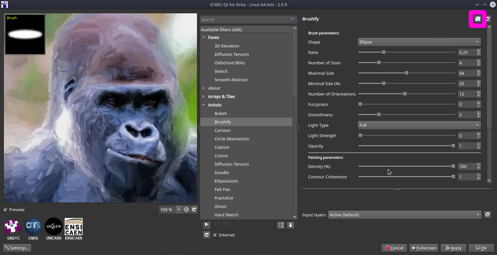

this repo tries to show examples of using [G'mic](https://gmic.eu/) which is a free and open source framework for image processing, it is multi platform with gui and cli versions, we'll use the gui on gimp or krita to get a feel for how the filters look and use the cli version for batch processing as our goal is making animated gifs

more comprehensive examples of the filters can be found in the G'mic website [here](https://gmic.eu/gallery/) click on every image to see the cli command

### quick links
 * [brushify](https://github.com/junguler/_image-manipulation/tree/main/G'mic#brushify)
 * [cartoon](https://github.com/junguler/_image-manipulation/tree/main/G'mic#cartoon)
 * [chalk it up](https://github.com/junguler/_image-manipulation/tree/main/G'mic#chalk-it-up)
 * [color abstraction paint](https://github.com/junguler/_image-manipulation/tree/main/G'mic#color-abstraction-paint)
 * [diffusion tensors](https://github.com/junguler/_image-manipulation/tree/main/G'mic#diffusion-tensors)
 * [dream smoothing](https://github.com/junguler/_image-manipulation/tree/main/G'mic#dream-smoothing)
 * [ellipsionism](https://github.com/junguler/_image-manipulation/tree/main/G'mic#ellipsionism)
 * [ghost](https://github.com/junguler/_image-manipulation/tree/main/G'mic#ghost)
 * [hough sketch](https://github.com/junguler/_image-manipulation/tree/main/G'mic#hough-sketch)
 * [polygonize delaunay](https://github.com/junguler/_image-manipulation/tree/main/G'mic#polygonize-delaunay)
 * [polygonize energy](https://github.com/junguler/_image-manipulation/tree/main/G'mic#polygonize-energy)
 * [poster edges](https://github.com/junguler/_image-manipulation/tree/main/G'mic#poster-edges)
 * [posterize](https://github.com/junguler/_image-manipulation/tree/main/G'mic#posterize)
 * [quadtree variations](https://github.com/junguler/_image-manipulation/tree/main/G'mic#quadtree-variations)
 * [shapeism](https://github.com/junguler/_image-manipulation/tree/main/G'mic#shapeism)
 * [skeletik](https://github.com/junguler/_image-manipulation/tree/main/G'mic#skeletik)
 * [vector paint](https://github.com/junguler/_image-manipulation/tree/main/G'mic#vector-paint)
 * [emboss](https://github.com/junguler/_image-manipulation/tree/main/G'mic#emboss)
 * [abstraction](https://github.com/junguler/_image-manipulation/tree/main/G'mic#abstraction)
 * [metallic look](https://github.com/junguler/_image-manipulation/tree/main/G'mic#metallic-look)
 * [local orientation](https://github.com/junguler/_image-manipulation/tree/main/G'mic#local-orientation)
 * [super pixels](https://github.com/junguler/_image-manipulation/tree/main/G'mic#super-pixels)
 * [marble](https://github.com/junguler/_image-manipulation/tree/main/G'mic#marble)
 * [mineral](https://github.com/junguler/_image-manipulation/tree/main/G'mic#mineral)
 * [wiremap](https://github.com/junguler/_image-manipulation/tree/main/G'mic#wiremap)

## how the gui looks and where to get the code to run on cli


when you found a filter you are happy with click the button highlighted in above picture to copy the code for batch proccessing

## our source clip
https://user-images.githubusercontent.com/59083599/133708382-4052c160-2e85-4d8d-bba7-5da601253fec.mp4

i made a post explaining how to download, cut, make a image sequence, apply filters and mux again [here](https://github.com/junguler/ffmpeg-examples/tree/main/sequence%2C%20manipulate%20%26%20mux%20images) and will not repeat how i made this clip and image sequence again for saving time

## brushify
```
for i in *.jpg; do echo $i; gmic $i fx_brushify 7,0.25,4,64,25,12,0,2,4,0,1,100,1,1,4,5,0,1,1 -o g-$i ; done
```
https://user-images.githubusercontent.com/59083599/133708901-c5cf30ba-4254-4dce-82e9-48d2cd18922d.mp4

## cartoon
```
for i in *.jpg; do echo $i; gmic $i cartoon 3,100,30,1,2,64,0,50,50 -o g-$i ; done
```
https://user-images.githubusercontent.com/59083599/133709403-1bf9d780-8e62-4974-a7ee-f444205c243f.mp4

## chalk it up
```
for i in *.jpg; do echo $i; gmic $i samj_chalkitup 1,10,5,0,1,5,6,0,0,7,0.9,1.76,7,0 -o g-$i ; done
```
https://user-images.githubusercontent.com/59083599/133709781-e7d13e53-8097-4a39-8845-4a119886035a.mp4

## color abstraction paint
```
for i in *.jpg; do echo $i; gmic $i fx_ColorAbstractionPaint 5,10,1,0,1,0,1,0,0,0,0,0,0,0 -o g-$i ; done
```
https://user-images.githubusercontent.com/59083599/133710530-16f15098-4d34-4656-aec5-b1a7937ac515.mp4

## diffusion tensors
```
for i in *.jpg; do echo $i; gmic $i fx_diffusiontensors 10,10,3,1,0.15,1,0,3,0,50,50 -o g-$i ; done
```
https://user-images.githubusercontent.com/59083599/133711303-d091064d-e90b-4108-a6d8-dbbc90d85025.mp4

## dream smoothing
```
for i in *.jpg; do echo $i; gmic $i fx_dreamsmooth 10,1,1,0.8,0,0.8,1,24,0 -o g-$i ; done
```
https://user-images.githubusercontent.com/59083599/133711985-b6708dff-d65a-48fc-8b7c-0043c43f6590.mp4

## ellipsionism
```
for i in *.jpg; do echo $i; gmic $i fx_ellipsionism 20,10,10,1,3,0.5,0,50,50 -o g-$i ; done
```
https://user-images.githubusercontent.com/59083599/133845372-7f30c6ad-8763-4a2a-9505-b852e9bf7518.mp4

## ghost
```
for i in *.jpg; do echo $i; gmic $i fx_ghost 200,10,0,-0.5,5,64,0,0,50,50 -o g-$i ; done
```
https://user-images.githubusercontent.com/59083599/133845918-578dab21-aeff-4bad-b8ac-c57e22136ad8.mp4

## hough sketch
```
for i in *.jpg; do echo $i; gmic $i fx_houghsketchbw 1.25,10,5,80,0.05,4,0,50,50 -o g-$i ; done
```
https://user-images.githubusercontent.com/59083599/133846756-e7bdb35e-552b-41b6-b342-d90fcd56d1ba.mp4

## polygonize delaunay
```
for i in *.jpg; do echo $i; gmic $i fx_polygonize_delaunay 22,5,75,0.5,3,0,0,0,0,255,1,0,50,50 -o g-$i ; done
```
https://user-images.githubusercontent.com/59083599/133847507-add052ac-242e-4c8d-adb1-40e5803879e1.mp4

## polygonize energy
```
for i in *.jpg; do echo $i; gmic $i fx_polygonize 300,10,10,10,10,0,0,0,255,0,50,50 -o g-$i ; done
```
https://user-images.githubusercontent.com/59083599/133847671-073478bd-bc37-41ec-810c-73c736d5b0a9.mp4

## poster edges
```
for i in *.jpg; do echo $i; gmic $i fx_poster_edges 20,60,5,0,10,0,0,0,50,50 -o g-$i ; done
```
https://user-images.githubusercontent.com/59083599/133848115-63c494ed-24a6-461d-a5cc-2ef9020e743e.mp4

## posterize
```
for i in *.jpg; do echo $i; gmic $i fx_posterize 150,30,1,32,0,100,0,0,50,50 -o g-$i ; done
```
https://user-images.githubusercontent.com/59083599/133848789-0f89f629-1a30-47d1-835e-63ba9ecfc950.mp4

## quadtree variations
```
for i in *.jpg; do echo $i; gmic $i fx_quadtree 2,1024,0.5,0,3,1.5,1,1,0,50,50 -o g-$i ; done
```
https://user-images.githubusercontent.com/59083599/133850105-9257599a-5ca2-4c25-8521-6ddbe3a6782c.mp4

## shapeism
```
for i in *.jpg; do echo $i; gmic $i fx_shapeism 1,7,0.38,0,1,5,32,8,3,1,5,0.5,1,0,0,0,255 -o g-$i ; done
```
https://user-images.githubusercontent.com/59083599/133853107-b994bdbd-cbc4-4141-b7eb-68f740f5ca2d.mp4

## skeletik
```
for i in *.jpg; do echo $i; gmic $i samj_Test_Skeletik 10,1,0,0,0,3,1,0,0,0,255 -o g-$i ; done
```
https://user-images.githubusercontent.com/59083599/133853486-2a72acc8-251b-4830-9725-9f2886e8e0b9.mp4

## vector paint
```
for i in *.jpg; do echo $i; gmic $i fx_vector_painting 9.5,0,50,50 -o g-$i ; done
```
https://user-images.githubusercontent.com/59083599/133854179-c094977f-8f3b-47a0-825d-be19a3141cfc.mp4

## emboss
```
for i in *.jpg; do echo $i; gmic $i gcd_emboss 128,0 -o g-$i ; done
```
https://user-images.githubusercontent.com/59083599/133929629-a3754722-c010-4e05-99fb-cbba4e5a1019.mp4

## abstraction
```
for i in *.jpg; do echo $i; gmic $i fx_color_abstraction 0,16,0.2,0,50,50 -o g-$i ; done
```
https://user-images.githubusercontent.com/59083599/133950086-204bc72f-64b2-47c5-882f-44a31ccd478d.mp4

## metallic look
```
for i in *.jpg; do echo $i; gmic $i fx_tk_metallic 1,0,0,0 -o g-$i ; done
```
https://user-images.githubusercontent.com/59083599/133950354-68b24c54-c454-49e8-9f6a-ef496ce1545f.mp4

## local orientation
```
for i in *.jpg; do echo $i; gmic $i fx_local_orientation 0.4,0,100,0,0,0,50,50 -o g-$i ; done
```
https://user-images.githubusercontent.com/59083599/133950487-fd5aa83c-014d-42b2-ba8d-7627aac6772f.mp4

## super pixels
```
for i in *.jpg; do echo $i; gmic $i fx_superpixels 32,24,6,1,1,0,0,0,255,0,50,50 -o g-$i ; done
```
https://user-images.githubusercontent.com/59083599/133950646-66e1ca7c-2be9-4264-be6e-eefabb29d79c.mp4

## marble
```
for i in *.jpg; do echo $i; gmic $i fx_marble 0.4,0.4,0,0,0.4,0.6,0.6,1.1,0,100 -o g-$i ; done
```
https://user-images.githubusercontent.com/59083599/133951583-18cc7502-d698-4910-99d3-6ea9aafe679c.mp4

## mineral
```
for i in *.jpg; do echo $i; gmic $i fx_mineral_mosaic 1.299,2,1,100,0 -o g-$i ; done
```
https://user-images.githubusercontent.com/59083599/133951689-ec5c3c19-6183-4e09-9260-73b9c609d3b6.mp4

## wiremap
```
for i in *.jpg; do echo $i; gmic $i gcd_wiremap 150,250,0.5,0.5,1 -o g-$i ; done
```
https://user-images.githubusercontent.com/59083599/133994737-3add148c-7c5f-4a11-b09f-9735ff1d8380.mp4
