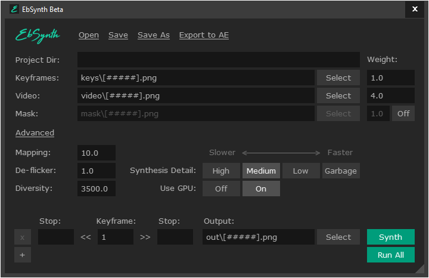

## ebsynth(gui)
ebsynth is a gui program that takes 1 or few images as style and applies them to an image sequence, unlike other style transfer programs ebsynth tries to stay as close to the source materaial as possible, you can find the beta version of the software from their website [here](https://ebsynth.com/) unfortunently there is no linux version available at the moment and the release version is meant to be a paid product but we still have access to the beta version for free on windows and mac os

## source material
everything is taken from free, no copywright stock footage from youtube

## how the program looks


the easiest way to use the program is to provide a keyframe, an image sequence and hi `Run All`

## the basics
this program has a few limitations that you need to know about to make life easier for yourself, the first thing is the keystroke(s) has to be in the same dimensions (width and height) at the output image sequence and it also needs to be named with the same number of leading zeros, so if i have my keystroke that is named img001.jpg and my image sequence that starts at img001.jpg and ends at img100.jpg the programs can easily understand what is going on

this might seem like chore but i'll give some commandline on-liners to make your life easier especially when we are making an image sequence out of a video clip

there is also this amazing [github repo](https://github.com/MyNameJeremy/EzEb) that makes everything automated for you using python, check it out and give the author a star as a thank you

## first step, find a good clip
lets say i've found a good free video i want to apply some cool looking effects to, lets download it first with yt-dlp

```
yt-dlp -f 22 https://www.youtube.com/watch?v=L_zNbr8KfDo
```

lets rename this to something simplier to make life easier, i've named this `boy.mp4`

## second step, turn the clip to an image sequence
using ffmpeg, lets convert our newly downloaded clip to an image sequence, make a new folder and cd into it with the video inside

```
ffmpeg -y -i boy.mp4 -c:v mjpeg -q:v 2 -pix_fmt yuvj444p -sn -an -threads 0 %04d.jpg
```

notice we named our image seuqeunce starting 4 leading zeros using `%04d` so our first image starts at `0001.jpg` this is needed for ebsynth to easily function and see our image sequence

note if you have a large video that needs to be trimed down use the [losslesscut](https://github.com/mifi/lossless-cut/releases) program to easily make a small clip out of it or run this ffmpeg command if you prefer to stay at the command line and then turn the smaller clip to image sequence just like above example

```
ffmpeg -i boy.mp4 -ss 1 -to 4 -c copy boy2.mp4
```

the above command starts the smaller clip at 1 second and stops and 4 seconds, for the sake of making the example shorter i'm going to use a small section of this image sequence
